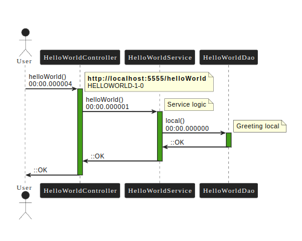
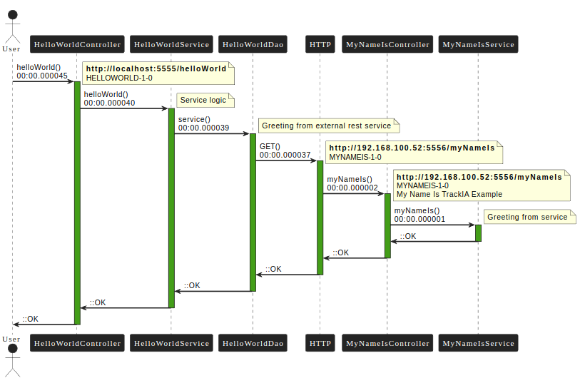
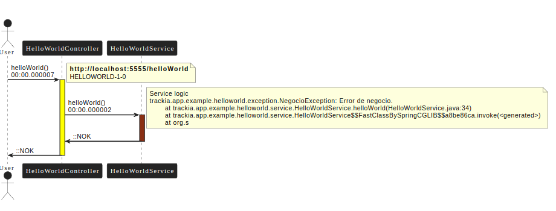

# @Trackia: Ejemplo hello World


## Introducción


Este software es parte de un conjunto de ejemplos que demuestran el funcionamiento de la librería @Trackia version 1.1.6.
Para más información puede dirigirse a la página de la librería [www.trackia.app](www.trackia.app) donde encontrará la documentación oficial y otros ejemplos relacionados.


Si bien, es posible ejecutar este servicio de manera autónoma, el ejemplo es aun más ilustrativo si se ejecuta junto a my-name-is-demo.
- [hello-world-demo](https://github.com/trackiaapp/hello-world-demo)
- [my-name-is-demo](https://github.com/trackiaapp/my-name-is-demo)


Por lo que se recomienda bajar ambos fuentes y ejecutarlos en combinación.


## Arquitectura

Para que este ejemplo sea mas eficiente, es necesario entender la arquitectura de implementada. Este software esta construido en 3 capas:
- Controlador
- Servicio
- Repositorio


## Descripción
Este proyecto responde "Hello World, my name is @Trackia". Como parámetro de entrada recibe "type" que condiciona el flujo de ejecución, donde básicamente puede tener los siguientes valores:

**local**: Ejecuta el saludo de manera autónomo, es decir, toda la transacción ocurre dentro de un solo servicio. Ilustra la journalización en su manera mas básica.

**service**: Ejecuta un segundo servicio (my-name-is-demo), para completar el saludo. Ilustra la journalización de 2 servicios dentro de la misma transacción, para completar el caso de éxito, debes tener ambos servicios ejecutando.

**local**: Arroja una excepción. Este parámetro ilustra como se visualizan los errores journalizados.


## Ejemplos

**GET**: http://localhost:5555/helloWorld

**Body**

```
{
   "type": "local"
}
```

Salida:

```
{
    "hello": "Hello World, my name is @TrackIA",
    "journalId": "d30a13d5-40e0-4863-824b-7be765fb4404",
    "help": "local, service, error"
}

```
Donde **journalId** es el número de transacción para realizar el seguimiento. Si se consulta el journalId en el E2E de trackia el resultado será el siguiente:





**GET**: http://localhost:5555/helloWorld

**Body**

```
{
    "type": "service"
}

```

Salida:

```
{
    "hello": "Hello World, my name is service @TrackIA",
    "journalId": "cef0ec34-0411-4cae-9c59-4cbf53619ab7",
    "help": "local, service, error"
}

```




**GET**: http://localhost:5555/helloWorld

**Body**

```
{
    "type": "error"
}

```

Salida:

```
{
    "code": "300",
    "message": "I can't say hello",
    "journalId": "604eafe6-20ff-4ff2-828a-464b8332775b"
}

```




## Configuración
El proyecto está configurado con un archivo yml en la ruta: **hello-world-demo/src/main/resources/application.yml** con algunos parámetros por default.


Lo primero que debe considerar es que se ejecuta en localhost en el puerto 5555.

Otro aspecto importante a considerar, es que la configuración inicial envía la salida hacia el log, si desea cambiar la salida al servicio de trackia, debe crear una cuenta y modificar los valores de "trackia.dispatcher", para más información visite la documentación de dispatcher en
[www.trackia.app/documentacion/dispatcher](www.trackia.app/documentacion/dispatcher)


## Licencia
Proyecto de código abierto, siéntase libre de bajar y modificar este software como estime conveniente.

